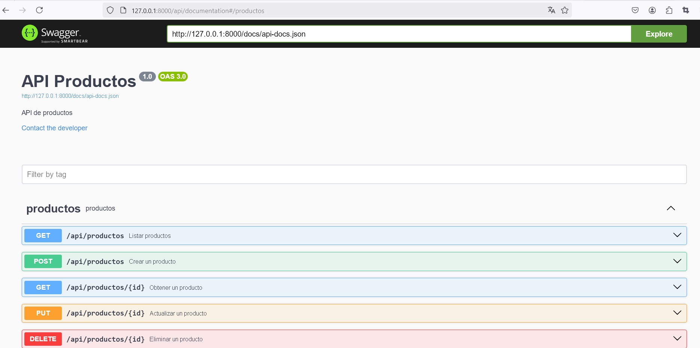
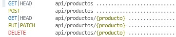

## Utilizando Laravel 11 para el desarrollo de un servicio web REST
Laravel 11 para el desarrollo de una api utiliza el módulo [laravel sanctum](https://documentacionlaravel.com/docs/11.x/sanctum) para la gestión de la autenticación del usuario

### Preparar el desarollo de la API

Para crear una api, ejecutamos el comando dentro del proyecto 

```bash
 php artisan install:api
```
Y vemos que nos instala `Laravel sanctum`, se crea un `fichero de rutas para las API` y nos ofrece ejecutar la migración donde ha creado una `nueva tabla personal_access_tokens`

Ahora debemos ir al `modelo User` y añadir `HasApiTokens`, esta configuración solo la requerimos si el sistema require autenticación.

```php

<?php

namespace App\Models;

// use Illuminate\Contracts\Auth\MustVerifyEmail;
use Illuminate\Database\Eloquent\Factories\HasFactory;
use Illuminate\Foundation\Auth\User as Authenticatable;
use Illuminate\Notifications\Notifiable;
use Laravel\Sanctum\HasApiTokens;

class User extends Authenticatable
{
    /** @use HasFactory<\Database\Factories\UserFactory> */
    use HasFactory, Notifiable, HasApiTokens;
```
Si ejecutamos 
```bash
 php artisan route:list
```
Nos muestra las rutas necesarias que nos ha creado la ruta **api/user**  y la ruta **sanctum/csrf-cookie**  que es para utilizarla en aplicaciones SPA (Una single-page application)

Vamos a utilizar [**Swagger**](https://swagger.io) para la documentación y prueba del servicio

Swagger es un conjunto de herramientas de software de código abierto que se utiliza para diseñar, construir, documentar y consumir servicios web RESTful. Swagger permite a los desarrolladores describir la estructura de sus APIs de manera estandarizada utilizando el formato OpenAPI Specification (OAS). Esto facilita la generación de documentación interactiva, la validación de las APIs y la creación de clientes y servidores en varios lenguajes de programación.

Swagger incluye herramientas como Swagger Editor, Swagger UI y Swagger Codegen, que ayudan en diferentes etapas del ciclo de vida de una API. Por ejemplo, Swagger UI proporciona una interfaz gráfica interactiva para probar y visualizar las APIs, mientras que Swagger Codegen permite generar código cliente y servidor a partir de la especificación de la API.

Instalamos swagger a través de composer:

```bash 
composer require darkaonline/l5-swagger 
php artisan vendor:publish --provider "L5Swagger\L5ServiceProvider"
```
y cada vez que realizamos un cambio en la documentación utilizamos el comando:

```bash 
php artisan L5-swagger:generate
```
Para ver la documentación en el servidor atiende a la ruta **api/documentation**

Ejemplo:




### Definir una API que no requiere autenticación

Las rutas de un servicio web las definimos en el fichero **api.php** que se encuentra en el directorio `routes`.

Si vamos a definir una API que implemente un CRUD, por ejemplo, una entidad `Producto` gestionada a través de un controlador denominado `ProductoController`:
```bash 
Route::apiResource('productos', ProductoController::class);
```
Nos genera todas las rutas necesarias para gestionar el CRUD



Como vemos en la imagen nos genera todas las rutas necesarias para crear un CRUD en este ejemplo de la entidad `Producto`.

#### Ejemplo básico CRUD
Los pasos a realizar:
1. Crearemos un proyecto nuevo denominado `ApiProductos`
2.  Realizaremos los pasos de **Preparar el desarrollo de la api** del punto anterior
3. Para el ejemplo trabajaremos con dos entidades:
  * Crearemos una tabla denominada `categorias` y otra tabla denominada `productos`
  * Crearemos los modelos `Categoria` y `Producto`
 
```php
php artisan make:model Categoria
php artisan make:migration create_categorias_table

``` 
La tabla categorias en el método up tiene:
```php
  public function up(): void
    {
        Schema::create('categorias', function (Blueprint $table) {
            $table->id();
            $table->string('nombre',100);
            $table->timestamps();
        });
    }
``` 
La tabla productos en el método up tiene:
```php
 public function up(): void
    {
        Schema::create('productos', function (Blueprint $table) {
            $table->id();
            $table->string('nombre',100);
            $table->text('descripcion')->nullable();
            $table->decimal('precio', 8, 2);
            $table->integer('stock');
            $table->unsignedBigInteger('categoria_id')->nullable();
            $table->foreign('categoria_id')->references('id')->on('categorias');
            $table->timestamps();
        });
    }
```
El modelo de Categoria, que a continuación muestro figura documentado con swagger
```php
<?php

namespace App\Models;

use Illuminate\Database\Eloquent\Model;
/**
 * @OA\Schema(
 *  schema="Categoria",
 *  type="object",
 *  title="Categoria",
 *  @OA\Property(property="id", type="integer", example="1"),
 *  @OA\Property(property="nombre", type="string", example="Categoria 1")
 *  )
 */
class Categoria extends Model
{
    protected $table = 'categorias';
    protected $fillable = ['nombre'];
    public function productos()
    {
        return $this->hasMany(Producto::class);
    }
}
```
Realiza el modelo Producto y crea un conjunto de datos ficticios para ambas entidades a través de Seeder y Factory
Por ejemplo, para la entidad 'Categoria' crear un 'CategoriaSeeder'
```php
<?php

namespace Database\Seeders;

use Illuminate\Database\Console\Seeds\WithoutModelEvents;
use Illuminate\Database\Seeder;
use App\Models\Categoria;

class CategoriaSeeder extends Seeder
{
   private $familia=[
        'Electrodomésticos',
        'Informática',
        'Telefonía',
        'Moda',
        'Deporte',
        'Hogar',
        'Jardín',
        'Bricolaje',
        'Mascotas',
        'Juguetes',
    ];
    /**
     * Run the database seeds.
     */
    public function run(): void
    {
        foreach ($this->familia as $familia) {
            Categoria::create(['nombre' => $familia]);
        }
    }
}
```
4. Una vez preparados los datos vamos a crear un `Resource` para cada entidad. Un `Resource` en Laravel se utiliza para transformar los modelos y colecciones de modelos en JSON, lo que es útil para estructurar las respuestas de la API.

Aquí tienes un ejemplo de cómo crear un `ProductoResource`:

**Crear el Resource**:
   Ejecuta el siguiente comando en la terminal para crear el resource:
   ```bash
   php artisan make:resource ProductoResource
   ```

**Definir el Resource**:
   Abre el archivo generado en `app/Http/Resources/ProductoResource.php` y define cómo se transformará el modelo `Producto` en JSON:
   ```php
   // filepath: /app/Http/Resources/ProductoResource.php
   <?php
    namespace App\Http\Resources;

    use Illuminate\Http\Request;
    use Illuminate\Http\Resources\Json\JsonResource;

    class ProductoResource extends JsonResource
    {
        /**
        * Transform the resource into an array.
        *
        * @return array<string, mixed>
        */
        public function toArray(Request $request): array
        {
            return [
                'id' => $this->id,
                'nombre' => $this->nombre,
                'descripcion' => $this->descripcion,
                'precio' => $this->precio,
                'stock' => $this->stock,
                'categoria' =>new CategoriaResource($this->whenLoaded('categoria')),
            ];
        }
    }
   ```

**Usar el Resource en el Controlador**:
   En el controlador `ProductoController`, usa el `ProductoResource` para devolver las respuestas:
   ```php
   // filepath: /app/Http/Controllers/ProductoController.php
   use App\Http\Resources\ProductoResource;
   use App\Models\Producto;

   class ProductoController extends Controller
   {
       public function index()
       {
           $productos = Producto::with('categoria')->get();
           
           return ProductoResource::collection($productos);
       }

       public function show($id)
       {
           $producto = Producto::with('categoria')->findOrFail($id);
           return new ProductoResource($producto);
       }

       // Otros métodos del controlador...
   }
   ```

Esto asegura que las respuestas de la API estén estructuradas de manera consistente y clara.

5. Definir el controlador `ProductoController` y documentar el controlador y los métodos para realizar la pruebas de la API a través de Swagger
 
Por ejemplo, como documentación del controlador `ProductoController` debe realizarse antes de la definición de la clase
```php 
    <?php
    namespace App\Http\Controllers;

    use App\Http\Resources\ProductoResource;
    use Illuminate\Http\Request;
    use App\Models\Producto;
    /**
     * @OA\Info(title="API Productos", version="1.0",description="API de productos",
     * @OA\Server(url="http://localhost:8000"),
     * @OA\Contact(email="email@gmail.com"))
     */
    class ProductoController extends Controller
    {
```
Y un ejemplo de documentación del método `show` del controlador `ProductoController` 
```php 
   /**
     * Display the specified resource.
     */
    /**
     * @OA\Get(
     *  path="/api/productos/{id}",
     *  summary="Obtener un producto",
     *  description="Obtener un producto por su id",
     *  operationId="show",
     *  tags={"productos"},
     *  @OA\Parameter(
     *      name="id",
     *      in="path",
     *      description="Id del producto",
     *   required=true,
     *   @OA\Schema(type="integer",example="1")
     *  ),
     *  @OA\Response(
     *  response=200,
     *  description="Producto encontrado",
     *  @OA\JsonContent(ref="#/components/schemas/Producto")
     * ),
     *  @OA\Response(
     *  response=404,
     *  description="Producto no encontrado"
     *  )
     * )
     */
    public function show(Producto $producto)
    {
       return new ProductoResource($producto->load('categoria'));
    }
```
6. Cuando realizamos una Api CRUD, es importante realizar una validación de los datos creando un `Request Especifico` o bien realizando la validación con el `método validate` de la clase `Request`
Por ejemplo, si creamos un producto deberiamos validar:

```php
        $validatedData = $request->validate([
            'nombre' => 'required|max:100|unique:productos',
            'descripcion' => 'nullable|string',
            'precio' => 'required|numeric|min:0',
            'stock' => 'required|integer|min:0',
            'categoria_id' => 'nullable|integer|exists:categorias,id'
        ],[
            'nombre.max'=>'El nombre no puede tener más de 100 caracteres',
            'nombre.required'=>'El nombre es obligatorio',
            'nombre.unique'=>'El nombre ya existe',
            'precio.required'=>'El precio es obligatorio',
            'precio.numeric'=>'El precio debe ser un número',
            'precio.min'=>'El precio no puede ser negativo',
            'stock.required'=>'El stock es obligatorio',
            'stock.min'=>'El stock no puede ser negativo',
            'stock.integer'=>'El stock debe ser un número entero',
            'categoria_id.exists'=>'La categoría no existe'
        ]);
```
:computer: Hoja07_WebServices_01


#### Definir una API que requiere autenticación

Crear **un servicio** donde estén recogidas todas las posibles respuestas del Json y nos ayudamos delos [códigos de respuesta Http](https://developer.mozilla.org/es/docs/Web/HTTP/Status). Este servicio lo vamos a utilizar en todos los controladores para devolver la respuesta 

```php
php artisan make:class Services\API\Auth\ApiResponseService
```
```php
<?php
namespace App\Services\API\Auth;
use Illuminate\Http\JsonResponse;
use Symfony\Component\HttpFoundation\Response;

class ApiResponseService
{
    public static function success($data, $message = 'Success', $code = Response::HTTP_OK): JsonResponse
    {
        return response()->json([
            'status' => 'success',
            'message' => $message,
            'data' => $data,
        ], $code);
    }

    public static function error($message = 'Error', $code = Response::HTTP_BAD_REQUEST): JsonResponse
    {
        return response()->json([
            'status' => 'error',
            'message' => $message,
        ], $code);
    }

    public static function unauthorized($message = 'Unauthorized'): JsonResponse
    {
        return response()->json([
            'status' => 'error',
            'message' => $message,
        ], Response::HTTP_UNAUTHORIZED);
    }

    public static function forbidden($message = 'Forbidden'): JsonResponse
    {
        return response()->json([
            'status' => 'error',
            'message' => $message,
        ], Response::HTTP_FORBIDDEN);
    }

    public static function notFound($message = 'Not Found'): JsonResponse
    {
        return response()->json([
            'status' => 'error',
            'message' => $message,
        ], Response::HTTP_NOT_FOUND);
    }
}
```

Crear **una interfaz** para implementar el sistema de autenticación que tendrá al menos definición de los métodos login y logout

```php
php artisan make:interface Contracts\API\Auth\AuthServiceInterface
```
y en el implementamos los métodos para que nos devuelvan un `JsonResponse`

```php
<?php

namespace App\Contracts\API\Auth;

use Illuminate\Http\JsonResponse;

interface AuthServiceInterface
{
    public function login(array $credentials): JsonResponse;

    public function logout(): JsonResponse;
}
```
Crear **un servicio** que implementa la interfaz definida
```php
php artisan make:class Services\API\Auth\AuthSanctumService
```
Vamos a validar los datos de entrada al login por lo que vamos a crear un `Request`
```php
php artisan make:request API\Auth\LoginRequest
```
```php
<?php

namespace App\Http\Requests\API\Auth;

use Illuminate\Foundation\Http\FormRequest;

class LoginRequest extends FormRequest
{
    /**
     * Determine if the user is authorized to make this request.
     */
    public function authorize(): bool
    {
        return true;
    }

    /**
     * Get the validation rules that apply to the request.
     *
     * @return array<string, \Illuminate\Contracts\Validation\ValidationRule|array<mixed>|string>
     */
    public function rules(): array
    {
        return [
            'email' => 'required'|'email',
            'password' => 'required'|'string',
            'name' => 'required'|'string',
        ];
    }
}
```
Ahora vamos a crear los controladores que van a ser invocables para tener el código más segmentado aunque podriamos crear un solo controlador con todas las acciones.
```php
php artisan make:controller API\Auth\LoginController
php artisan make:controller API\Auth\LogoutController
```


## Ejemplo
Vamos a crear una librería con autores, generos y libros, donde un libro tendrá un autor y pertenecerá a un género Crearemos los modelos y la entidad asociada en base de datos. Para autores  y generos y en la definición de la tabla incorporamos el campo nombre con una longitud de 100 caracteres.
```php
php artisan make:model Autor
php artisan make:migration create_autores_table

```
```php
<?php

use Illuminate\Database\Migrations\Migration;
use Illuminate\Database\Schema\Blueprint;
use Illuminate\Support\Facades\Schema;

return new class extends Migration
{
    /**
     * Run the migrations.
     */
    public function up(): void
    {
        Schema::create('autores', function (Blueprint $table) {
            $table->id();
            $table->string('nombre',100);
            $table->timestamps();
        });
    }

    /**
     * Reverse the migrations.
     */
    public function down(): void
    {
        Schema::dropIfExists('autores');
    }
};
```
Definiremos el libro con los campos que figuran a continuación y establecemos las relaciones con autores y generos
```php
php artisan make:model Libro -m
```
```php

<?php

use Illuminate\Database\Migrations\Migration;
use Illuminate\Database\Schema\Blueprint;
use Illuminate\Support\Facades\Schema;

return new class extends Migration
{
    /**
     * Run the migrations.
     */
    public function up(): void
    {
        Schema::create('libros', function (Blueprint $table) {
            $table->id();
            $table->foreignIdFor(\App\Models\Autor::class)->constrained();
            $table->foreignIdFor(\App\Models\Genero::class)->constrained();
            $table->string('titulo', 100);
            $table->string('isbn', 13);
            $table->integer('paginas');
            $table->unsignedTinyInteger('stock');
            $table->date('publicado_en');
            $table->timestamps();
        });
    }
```
Ahora configuraremos los modelos, con el nombre de la tabla y las relaciones establecidas. A continuación figura el ejemplo de Autor  y del Libro
```php
<?php

namespace App\Models;

use Illuminate\Database\Eloquent\Model;
use Illuminate\Database\Eloquent\Relations\HasMany;

class Autor extends Model
{
    protected $table = 'autores';
    protected $fillable = ['nombre'];

    public function libros():HasMany
    {
        return $this->hasMany(Libro::class);
    }
}

<?php

namespace App\Models;

use Illuminate\Database\Eloquent\Model;

use Illuminate\Database\Eloquent\Relations\BelongsTo;

class Libro extends Model
{
    protected $fillable = ['titulo','isbn','autor_id','genero_id', 'paginas','stock','publicado_en'];

    protected function casts(): array
    {
        return [
            'publicado_en' => 'date:d-m-Y',
            'stock' => 'integer',
            'paginas' => 'integer',
        ];
    }
    public function autor(): BelongsTo
    {
        return $this->belongsTo(Autor::class);
    }

    public function genero(): BelongsTo
    {
        return $this->belongsTo(Genero::class);
    }

}
```
## Documentar una API con postman

En la página de [Postman](https://www.postman.com/) nos registramos  y a continuación definiremos `WorkSpace`, que es un espacio de trabajo donde vamos a documentar nuestras apis
y una `Collection` , una colección que será cada api que vamos a desarrollar.
También tenemos un `Environments` que donde podemos definir las variables de entorno a utilizar.
Dentro de una colección tenemos la posibilidad de definir variables, aunque si están definidas en el entorno son las que prevalecen.
